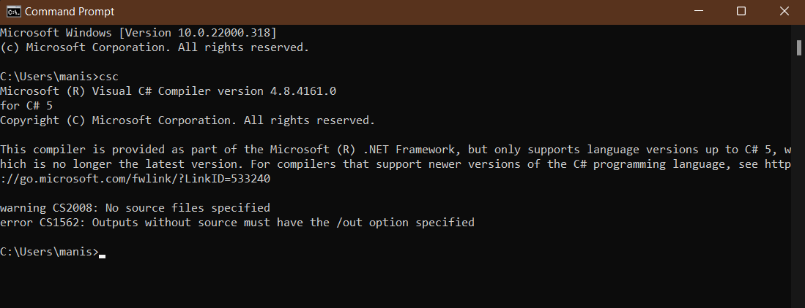
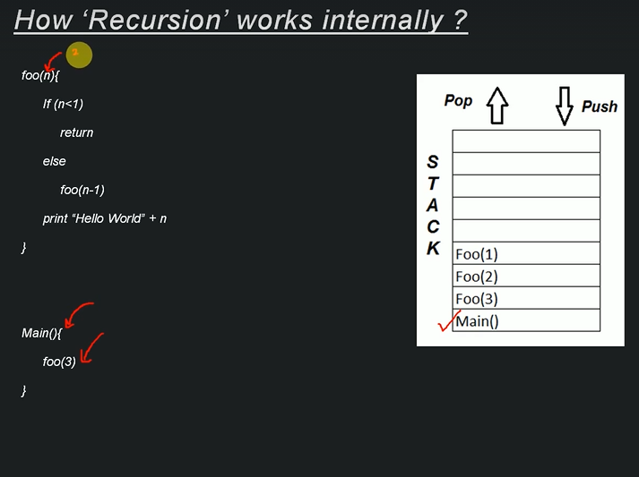

# Introduction to Recursion

Recursion is method of digging down a larger problem into smaller sub problems similar to the larger ones until an limit or end condition is reached. We will implement many recusive algorithms in our course. So hang tight! for now focus on theory.

## Properties of Recursion

1. Same operation is performed multiple times for different inputs
2. In every step we try to make the problem smaller
3. We mandatorily need to have a **base condition**, which tells the system when to stop the recursion.

## Format of a typical recursive function

```test program
SampleRecursion(parameter){
    if(base case is satisfied){//the base case
        return [some value]
    }
    SampleRecursion(modified parameter)//the recursion
}
```

### Memory utilization by Recursion

- Normal Execution
  
- Recursion Execution
  
