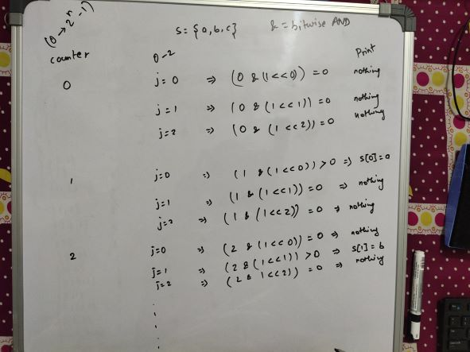

# Complexity Analysis [Some more examples]

## Finding all the subsets of a set

For a given set S = {a, b, c}, the power **P(S)** set is a set which contains all possible subsets of S.

P(S) = {{}, {a}, {b}, {c}, {a, b}, {a, c}, {b, c}, {a, b, c}}

General rule is that for a given Set with n distinct element, the power set contains 2<sup>n</sup> elements. Hence, total numbers of elements in S = 3, Total numbers of elements in P(S) = 8 (including the empty elements)

The formula for Power Set of a Set S with n distinct elements is something like the below:

P(S) = <sup>n</sup>C<sub>0</sub> + <sup>n</sup>C<sub>1</sub> + <sup>n</sup>C<sub>2</sub> + .... + <sup>n</sup>C<sub>n</sub>

Hence, for S = {a, b, c},

P(S) = <sup>3</sup>C<sub>0</sub> + <sup>3</sup>C<sub>1</sub> + <sup>3</sup>C<sub>2</sub> + <sup>3</sup>C<sub>3</sub>
= 1 + 3 + 3 + 1
= 8

There are two approaches to find the find the total number of elements in the power set of a set S. In both the cases the time complexity will be O(n2<sup>n</sup>)

- Backtracking Approach

  ```C#
  using System;
  using System.Collections.Generic;
  namespace ComplexityAnalysisExample_1_PowerSetBacktracking
  {
    class Program
    {
        static void PrintSet(Stack<int> set)
        {
            foreach (int element in set)
                Console.Write("{0} ", element);
            Console.WriteLine();
        }
        static void SubsetUtility( int[] set, Stack<int> subset, int index)
        {
            PrintSet(subset);
            for(int i=index; i< set.Length; i++)
            {
                subset.Push(set[i]);
                SubsetUtility(set, subset, i + 1);
                Console.WriteLine("Popped: "+subset.Pop());
            }

            return;
        }
        static void Main(string[] args)
        {
            int index = 0;
            int[] set = {1, 2, 3, 4};
            Stack<int> subset = new Stack<int>(3);

            SubsetUtility(set, subset, index);
            Console.ReadKey();
        }
    }
  }

  ```

- Iterative Approach (For this example its not the best way to understand it. but I've included it for completeness)

  Let's suppose a set S ={a, b, c}. So if we are making a set of all the possible sets of the set S, then for any set a, b, or c or any combination of item will present. Hence we can have only two states of a, b, c, i.e., either they are present (denoted by 1) or they are absent(denoted by 0). The combination of all the states of a, b, and c will be as the given table.

  | Counter Value | Set Element a | Set Element b | Set Element c | Actual Set       |
  | ------------- | ------------- | ------------- | ------------- | ---------------- |
  | 0             | 0             | 0             | 0             | {}, or Empty Set |
  | 1             | 0             | 0             | 1             | {c}              |
  | 2             | 0             | 1             | 0             | {b}              |
  | 3             | 0             | 1             | 1             | {b, c}           |
  | 4             | 1             | 0             | 0             | {a}              |
  | 5             | 1             | 0             | 1             | {a, c}           |
  | 6             | 1             | 1             | 0             | {a, b}           |
  | 7             | 1             | 1             | 1             | {a, b, c}        |

  ```Algorithm
  Input: Set[], set_size
    1. Get the size of power set
    powet_set_size = pow(2, set_size)
    2. Loop for counter from 0 to pow_set_size
     (a) Loop for i = 0 to set_size
          (i) If ith bit in counter is set
               Print ith element from set for this subset
     (b) Print separator for subsets i.e., newline

  ```

  ```C#
    using System;

    class GFG {

    static void printPowerSet(char []set, int set_size)
    {
        /*set_size of power set of a set
        with set_size n is (2**n -1)*/
        uint pow_set_size =
              (uint)Math.Pow(2, set_size);
        int counter, j;

        /*Run from counter 000..0 to 111..1*/
        for(counter = 0; counter < pow_set_size; counter++)
        {
            for(j = 0; j < set_size; j++)
            {
                /* Check if jth bit in the
                counter is set If set then
                print jth element from set */
                if((counter & (1 << j)) > 0)
                    Console.Write(set[j]);
                    //NOTE: by set means saying Non Zero.
                    //so not only the counter needs to be true or non zero but also the
                    //the digit 1 in the binary representation of counter should be at the right place,
                    //hence 1<<j is needed. It will ensure that we can perform '&' operation correctly
                    //we are controlling the position of 1 in (1<<j) programmatically

            }

            Console.WriteLine();
        }
    }

    // Driver program to test printPowerSet
    public static void Main ()
    {
        char []set = {'a', 'b', 'c'};
        printPowerSet(set, 3);
    }
  }

  ```

  
